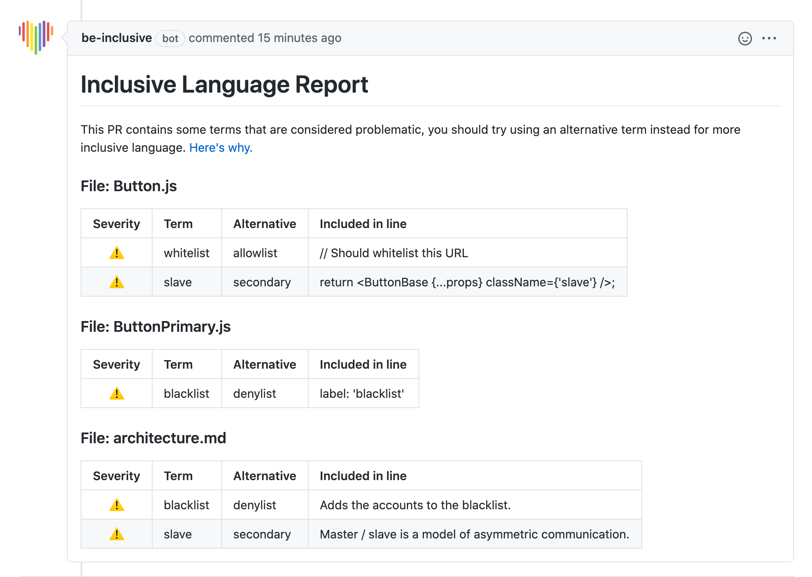

# inclusive-language
An inclusive language GitHub App that helps you remove offensive language from your code.

Once installed to a repository, this app will leave comments on new Pull Requests to notify the users that there are terms in newly added code that does not meet our inclusive language guidelines.

See the [rules.md](rules.md) for terms that this app considers prohibited.

## Example PR Comment


## Setup

```sh
# Install dependencies
npm install

# Run the bot
npm start
```

## Contributing

If you have suggestions for how inclusive-language could be improved, or want to report a bug, open an issue! We'd love all and any contributions.

For more, check out the [Contributing Guide](CONTRIBUTING.md).

## License

[ISC](LICENSE) © 2020 Juliana Leon <jewelsleon@gmail.com>
